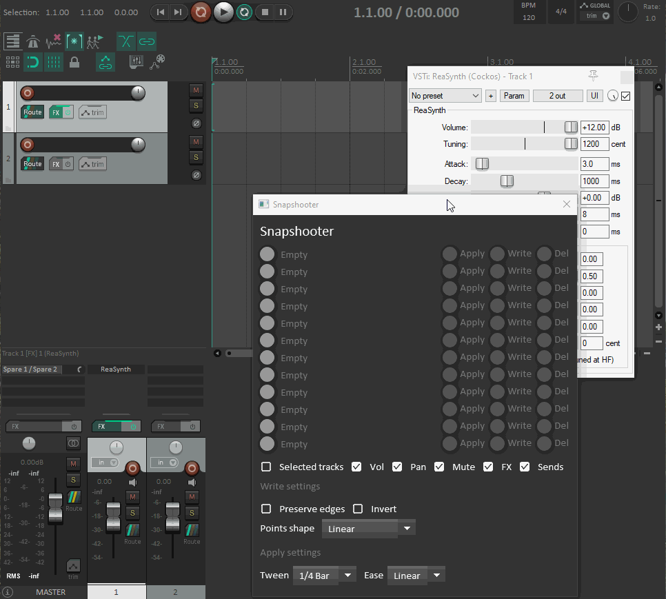

The following effects are published and available on ReaPack

## Snapshooter

Snapshooter allows to create param snapshots and recall or write them to the playlist creating patch morphs.
Different from SWS snapshots, only the params changed are written to the playlist as automation points.

#### Features:
  * Stores and retrieves FX params
  * Stores and retrieves mixer states for track Volume, Pan, Mute and Sends
  * Writes only changed params by diffing the current state and selected snapshot
  * Transition snapshots using tween and ease functions
  * Writes transitions into time selection from current state to snapshot

#### Tips:

  * Grab time selections and click **write** to write full transitions into timeline
  * Set global automation to READ to save current song snapshot
  * Set global automation to other value than READ to save snapshots from mixer state
  * If params are not writing make sure they have a different current value from the snapshot

## Keyboard splitter

Manage tracks keyboard splitting using a visual keymap.

## RS5K Mapper

Allows mapping multiple ReaSamplomatic5000 instances using a visual keymap.

